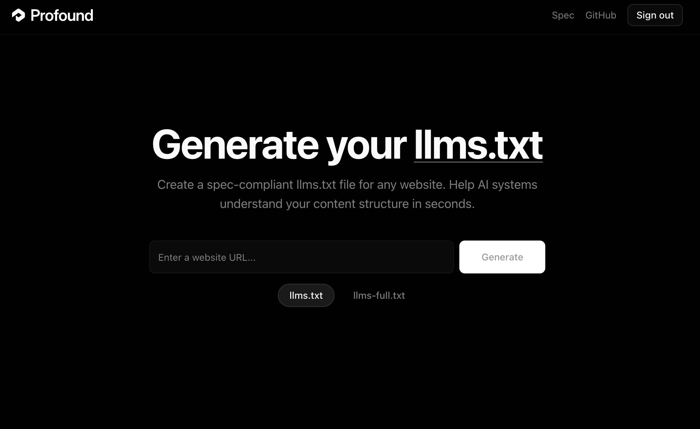
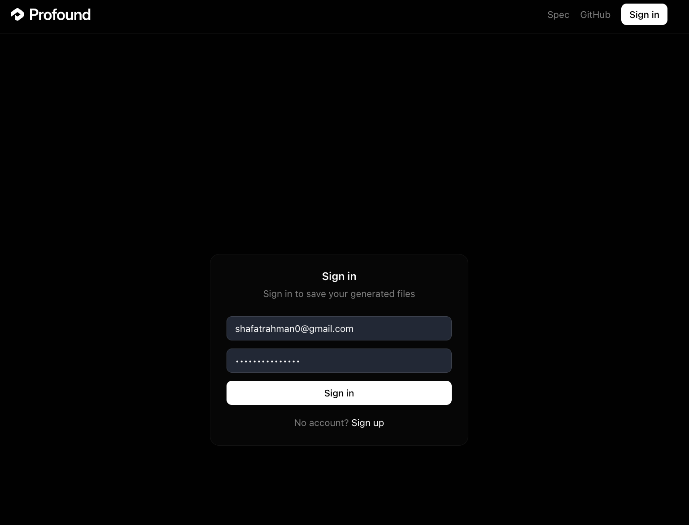
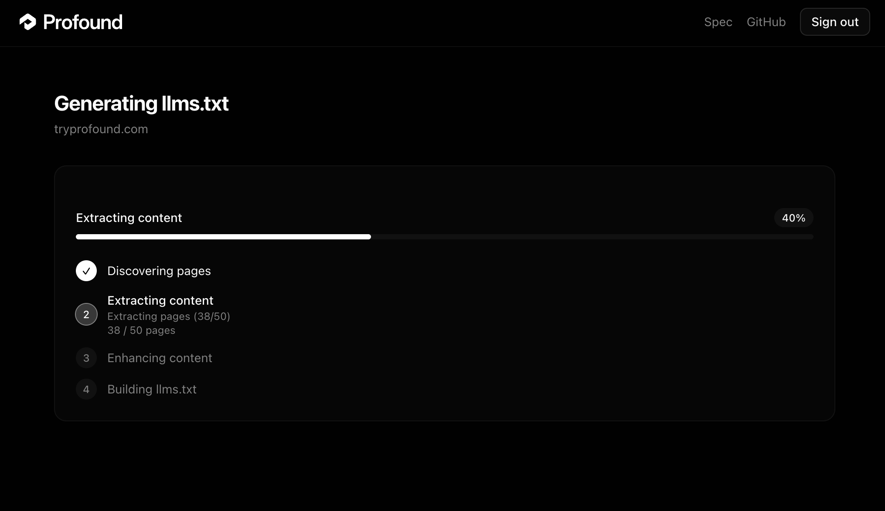
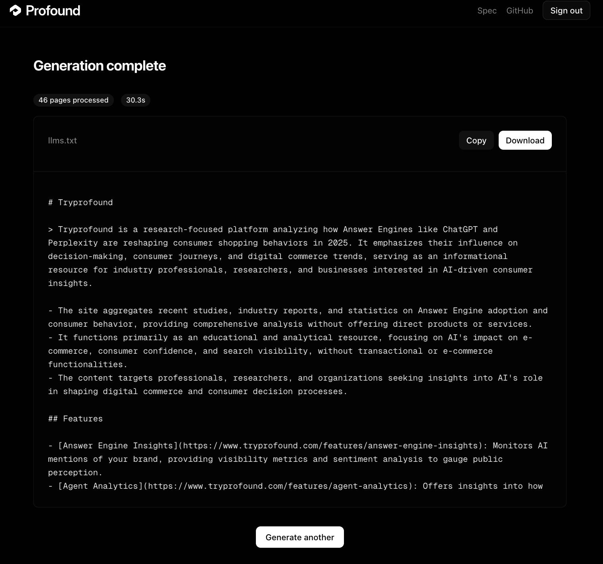

# Sponge -- Automated llms.txt Generator

Sponge is a web application that automatically generates spec-compliant [llms.txt](https://llmstxt.org/) files for any website. It crawls a site, extracts metadata and content, uses LLMs to produce high-quality descriptions, and assembles structured markdown files that help LLMs understand your website.

**Live at [spotidex.xyz](https://spotidex.xyz)**

## Demo

**Enter any URL and choose your output mode.**



**Optional sign-in to save your generation history.**



**Real-time progress tracking as the pipeline runs.**



**View, copy, or download the generated llms.txt.**



**Validation and errors surface as toasts.**


## Architecture

```
Frontend (Next.js)  -->  Django API (ECS)  -->  Celery Workers (ECS)
     |                       |                       |
   Vercel               Supabase (Auth/DB)      Playwright
                        Upstash Redis           OpenAI API
                                                Langfuse
```

- **Frontend**: Next.js 16 with App Router, shadcn/ui, Tailwind CSS v4. Dark theme. Deployed on Vercel.
- **Backend**: Django REST Framework + Celery. Deployed on AWS ECS Fargate.
- **Workers**: Single Celery worker pool (prefork). HTTP-first with Playwright fallback for CSR sites.
- **Infrastructure**: Terraform IaC, GitHub Actions CI/CD, SSM Parameter Store for secrets.

## Output Modes

| Mode | Output | Description |
|------|--------|-------------|
| Default (`llms.txt`) | AI-enhanced index with titles + descriptions | Curated site overview -- max 5 entries per section, polished for consistency. 15-45s. |
| Detailed (`llms-full.txt`) | LLM-cleaned page content inlined | Clean, informational content per page with marketing noise stripped. 30s-2min. |

Both modes use GPT-4.1-nano for description enhancement and site summaries. Default mode adds a final polish pass. Detailed mode adds per-page LLM content cleaning (strips CTAs, logo grids, testimonials) to produce clean markdown. Playwright is used as a fallback only when CSR or bot-blocking (403) is detected.

## Project Structure

```
sponge/
  frontend/                  # Next.js application (Vercel)
    app/                     # Pages (landing, job detail, auth)
    components/              # UI components (shadcn + custom)
    lib/                     # API clients, Zod models, Supabase, utilities
  backend/                   # Django + Celery (ECS Fargate)
    config/                  # Settings (base/dev/prod), Celery, ASGI, URLs
    apps/
      core/                  # Pydantic models, SSRF guard, rate limiter, cache, auth
      crawler/               # Robots parser, sitemap parser, BFS crawler, page fetcher
      extractor/             # Meta extraction (BS4), content extraction, Playwright provider
      generator/             # URL categorizer, llms.txt builder
      ai/                    # LLM client (OpenAI + Langfuse), description enhancer
      jobs/                  # Django ORM models, DRF serializers/views, Celery tasks, SSE
  infrastructure/            # Terraform IaC (VPC, ECR, ECS, ALB, IAM, SSM)
  docs/                      # Engineering documentation
  .github/workflows/         # CI/CD pipelines
  docker-compose.yml         # Local development
```

## Quick Start

### Prerequisites

- Python 3.11+, [uv](https://docs.astral.sh/uv/), Node.js 20+, Docker
- [Supabase](https://supabase.com) account (free tier) -- Postgres, Auth, Storage
- [OpenAI](https://platform.openai.com) API key -- required for both modes

### 1. Clone and configure

```bash
git clone https://github.com/ShafatRahman/sponge.git
cd sponge
cp backend/.env.example backend/.env
cp frontend/.env.example frontend/.env.local
```

Edit both `.env` files with your credentials. See [docs/setup/environment-variables.md](docs/setup/environment-variables.md) for details. For `DATABASE_URL`, use the Supabase **connection pooler** URI (port 6543), not the direct connection.

### 2. Start backend services

```bash
cp docker-compose.override.example.yml docker-compose.override.yml  # enables dev volume mounts
docker-compose up -d
docker-compose exec api uv run python manage.py migrate
```

This starts Redis, Django API (port 8000), and Celery Worker.

### 3. Start frontend

```bash
cd frontend
npm install
npm run dev
```

Visit http://localhost:3000.

### 4. Run without Docker (alternative)

```bash
cd backend
uv sync --dev
uv run playwright install chromium

# Terminal 1: Django API
uv run python manage.py migrate
uv run python manage.py runserver

# Terminal 2: Worker
uv run celery -A config worker --pool=prefork --concurrency=4 -l info

# Terminal 3: Frontend
cd frontend && npm install && npm run dev
```

### 5. Code quality

**Backend** (from `backend/`):
```bash
uv run ruff check .         # Lint
uv run ruff format .        # Format
uv run mypy apps/           # Type check
uv run pytest               # Test
```

**Frontend** (from `frontend/`):
```bash
npm run check               # Typecheck + lint + format (all-in-one)
npm run lint:fix             # Auto-fix lint issues
npm run format              # Auto-format with Prettier
```

Pre-commit hooks (Husky + lint-staged) automatically lint and format staged files.

## Deployment

### Frontend (Vercel)

Connect the repo to Vercel. Set root directory to `frontend/`. Configure environment variables in the Vercel dashboard.

### Backend (AWS ECS)

```bash
cd infrastructure
terraform init
terraform plan -var-file=environments/prod/terraform.tfvars
terraform apply -var-file=environments/prod/terraform.tfvars
```

CI/CD is handled by GitHub Actions:
- **Backend CI**: Lint + format check on every PR touching `backend/`
- **Frontend CI**: Typecheck + lint + format + build on every PR touching `frontend/`
- **Deploy Backend**: Build Docker, push to ECR, update ECS on merge to `main`
- **Terraform**: Plan on PR, apply on merge to `main`
- **Docs Check**: Reminds to update docs when code changes without doc updates

## Environment Variables

### Backend (`backend/.env`)

| Variable | Required | Description |
|----------|----------|-------------|
| `DATABASE_URL` | Yes | Supabase Postgres connection pooler URI (port 6543) |
| `SUPABASE_URL` | Yes | Supabase project URL |
| `SUPABASE_SECRET_KEY` | Yes | Supabase secret key (`sb_secret_...`) |
| `REDIS_URL` | Yes | Redis connection string |
| `OPENAI_API_KEY` | Yes | OpenAI API key (required -- powers LLM enhancement in both modes) |
| `LANGFUSE_PUBLIC_KEY` | No | Langfuse observability |
| `LANGFUSE_SECRET_KEY` | No | Langfuse secret key |
| `LANGFUSE_HOST` | No | Langfuse host (default: EU; set `https://us.cloud.langfuse.com` for US) |
| `DJANGO_SECRET_KEY` | No | Defaults to dev key; must set in production |
| `SENTRY_DSN` | No | Sentry error tracking; leave empty in local dev |

### Frontend (`frontend/.env.local`)

| Variable | Required | Description |
|----------|----------|-------------|
| `NEXT_PUBLIC_API_URL` | No | Backend API URL (default: `http://localhost:8000`) |
| `NEXT_PUBLIC_SUPABASE_URL` | Yes | Supabase project URL |
| `NEXT_PUBLIC_SUPABASE_PUBLISHABLE_KEY` | Yes | Supabase publishable key (`sb_publishable_...`) |
| `NEXT_PUBLIC_SENTRY_DSN` | No | Sentry DSN for frontend error tracking |

## API

| Method | Endpoint | Description |
|--------|----------|-------------|
| `GET` | `/api/health/` | Health check (ALB target) |
| `POST` | `/api/jobs/` | Create a generation job |
| `GET` | `/api/jobs/<id>/` | Get job status, progress, and results |
| `GET` | `/api/jobs/<id>/stream/` | SSE stream of real-time progress events |
| `GET` | `/api/jobs/history/` | Authenticated user's job history |

See [`docs/api/`](docs/api/) for the full API reference, authentication guide, and SSE protocol spec.

## Tech Stack

| Layer | Technology |
|-------|-----------|
| Frontend | Next.js 16, React 19, shadcn/ui, Tailwind CSS v4, Zod, Axios |
| Backend | Django 5.1, DRF, Celery 5.4, Pydantic 2 |
| Crawler | httpx, BeautifulSoup4, Playwright |
| AI | OpenAI GPT-4.1-nano, Langfuse |
| Database | Supabase (PostgreSQL + Auth + Storage) |
| Cache/Queue | Upstash Redis |
| Infrastructure | AWS ECS Fargate, ALB, Terraform |
| CI/CD | GitHub Actions (OIDC for AWS) |
| DX | uv, ruff, mypy, Prettier, ESLint 9, Husky, lint-staged |

## Documentation

Full engineering docs in [`docs/`](docs/):

| Section | Contents |
|---------|----------|
| [Setup](docs/setup/) | Local development, environment variables, Docker |
| [Architecture](docs/architecture/) | System design, backend pipeline, data flow, SSE streaming |
| [Technologies](docs/technologies/) | Every package/service with learning links |
| [Deployment](docs/deployment/) | AWS ECS, Vercel, CI/CD, SSM secrets |
| [Testing](docs/testing/) | Test structure, running tests |
| [API](docs/api/) | REST endpoints, authentication, SSE protocol |
| [Contributing](docs/contributing/) | Code style, git workflow, docs maintenance |

## License

MIT
